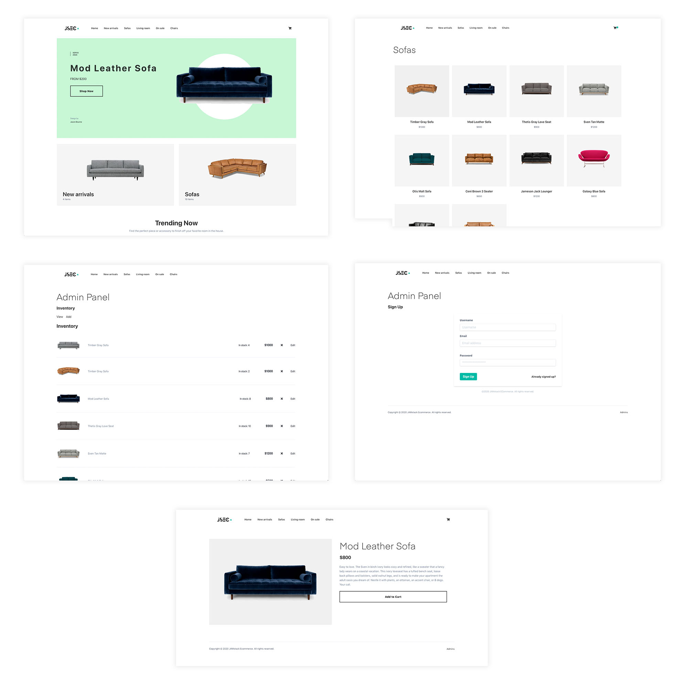

## JAMstack E Commerce Professional

This project provides a way to quickly get up and running with a fully configurable JAMstack E Commerce site.

Out of the box, the site uses completely static data coming from a provider at `providers/inventoryProvider.js`. You can update this provider to fetch data from any real API by changing the call in the `getInventory` function.



> This project is still in Beta.

### Getting started

1. Clone the project

```sh
$ git clone https://github.com/jamstack-cms/jamstack-ecommerce.git
```

2. Install the dependencies:

```sh
$ yarn

# or

$ npm install
```

3. Run the project

```sh
$ gatsby develop

# or to build

$ gatsby build
```

### Configuring inventory provider

Update __providers/inventoryProvider.js__ with your own inventory provider.

### Updating with Auth / Admin panel

1. Update __src/pages/admin.js__ with sign up, sign, in, sign out, and confirm sign in methods.

2. Update __src/templates/ViewInventory.js__ with methods to interact with the actual inventory API.

3. Update __src/components/formComponents/AddInventory.js__ with methods to add item to actual inventory API.

### Other considerations

#### Images

If you're using dynamic images over http, you can add a build step into `exports.createPages` in __gatsby-node.esm.js__ to download the images locally to improve the user experience. You can also add a placeholder image in __src/components/Image.js__ or make some adjustments in that component for other image loading enhancements.